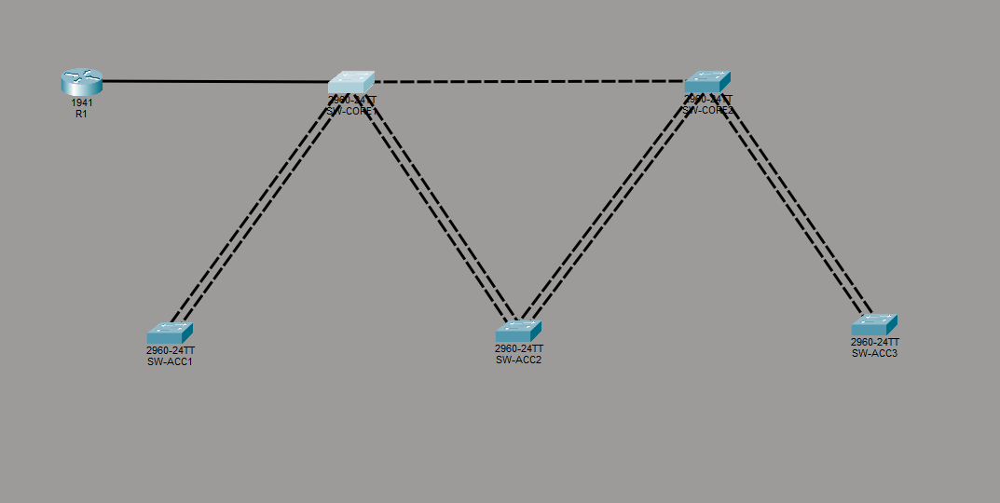

# Cisco-Vlan-STP-Routing-Project
Company Network: VLANs, RSTP, and Inter-VLAN Routing (Cisco Packet Tracer)
A company network designed and configured from scratch in Cisco Packet Tracer,
summarizing L2/L3 switching and routing fundamentals (VLANs, 802.1Q trunking,
Rapid Spanning Tree Protocol, router-on-a-stick, VLSM subnetting).

## Topology

- 2x core switches (redundantly connected to each other and to every access switch)
- 3x access switches — one per department (Sales, IT, Finance)
- 1x router — inter-VLAN routing (router-on-a-stick)
- Redundant uplinks are intentional, forcing Rapid Spanning Tree Protocol into action

## VLANs and Addressing

| VLAN | Name | Subnet | Gateway |
|---|---|---|---|
| 10 | SALES | 192.168.1.0/26 | 192.168.1.1 |
| 20 | IT | 192.168.1.64/27 | 192.168.1.65 |
| 30 | FINANCE | 192.168.1.96/27 | 192.168.1.97 |
| 99 | MANAGEMENT | 192.168.1.128/28 | 192.168.1.129 |

## Project Status

- [x] Phase 1: Physical topology
- [x] Phase 2: Device hardening (passwords, banner, service password-encryption)
- [ ] Phase 3: VLANs and access port assignment
- [ ] Phase 4: Trunking
- [ ] Phase 5: STP/RSTP (root bridge selection)
- [ ] Phase 6: Management (SVI)
- [ ] Phase 7: Inter-VLAN routing
- [ ] Phase 8: Testing and verification (including failover)

# Design Notes

## Tools
Cisco Packet Tracer
